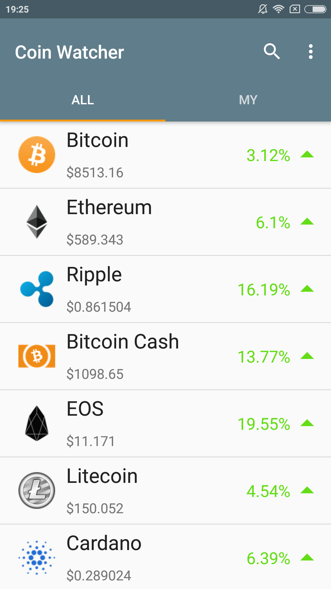
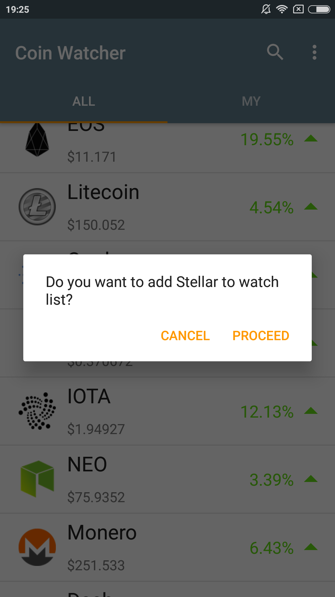
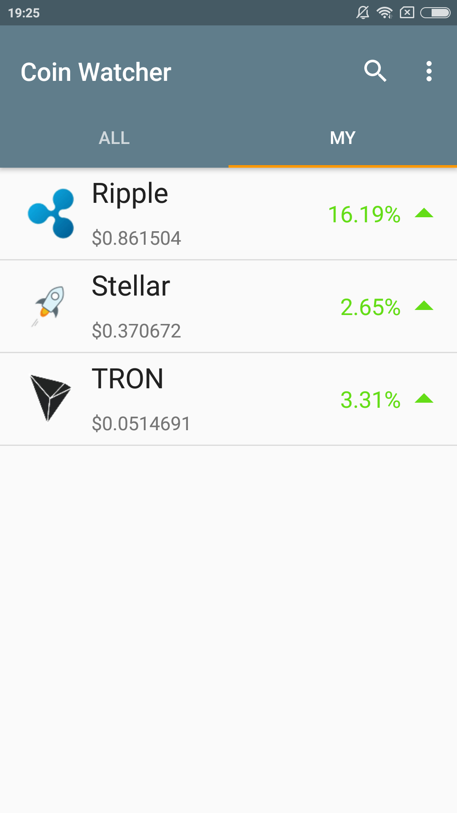

# Coin Watcher 

[Play Store link](https://play.google.com/apps/testing/pw.robertlewicki.coinwatcher)

### Libraries used during development:
* [Dagger2](https://github.com/google/dagger)
* [Jackson FasterXML](https://github.com/FasterXML/jackson)
* [OkHttp](http://square.github.io/okhttp/)
* [ButterKnife](http://jakewharton.github.io/butterknife/)
* [Retrofit](http://square.github.io/retrofit/)
* [Picasso](http://square.github.io/picasso/)
* [Timber](https://github.com/JakeWharton/timber)
* [Toasty](https://github.com/GrenderG/Toasty)
* [ShowcaseView](https://github.com/outlander24/ShowcaseView)
* [AutofitTextView](https://github.com/grantland/android-autofittextview)

### Screenshots

